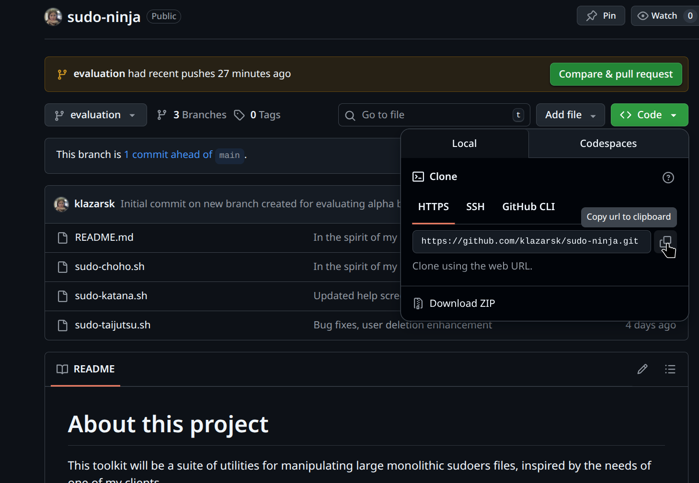

# Sudo ninja

## Copyright and license
Red Hat, Inc.  
Author: Kimberly Lazarski  
License: GPL  

## About
This is a small tool suite for analyzing and batch-maintaining large, monolithic
sudoers files. It is a work in progress and not quite alpha quality yet, much 
less beta, so please exercise extreme caution and consider it ready for 
unit and integration testing, but not yet production-ready.  

This tool suite was started, inspired by a client seeking to reduce technical
debt, but they weren't quite ready to move to IDM so we created this utility to 
help them bridge the gap.

Even once we achieve feature-completeness and a stable build, some analysis and
configuration of filters will be essential, as the default configuration is 
not one size fits all and will vary from environment to environment.

The utility allows for flattening of sudoers rules and aliases definitions, 
splitting of monolithic sudoers files, automated pruning of expired rules (as
specified by a `# EXP YYYY-MM-DD` comment string preceding a block of rules. 
That EXP date will apply to ALL rules in a continguous list (NO blank lines, and
NO comments in the block), up to the next commented line. So, to end the 
expiration date's affect on rules (and aliases, etc.), end the block with a
blank line, and then a `#commented-out line` 

# Processing the sudoers file

The goal of this project is to analyze the sudoers file and, if feasible, to
propose a solution for cleaning up the sudoers file, with the pruning of 
expired and invalid users being among the most important features.  

Because so many of the sudoers rules were multi-line, which is legal, but the
sudoers file format lacks a heirarchical wrapper (such as XML) or structure
(such as json), parsing the multi-line rules becaomes very challenging.  

After analysis and testing, we felt that pre-processing and reformatting the 
sudoers file to "flatten" the rules to make them easier to parse, was the best 
approach.  

We also split the rules into multiple files for easier processing, especially 
in regard to rules expiration.  

There are limitations - without a full, large-scale development approach, we
elected to rely on regular expression (regex) filter patterns to preserve 
aliases, rules, and other tokens which may be inadvertently matched by some 
of the processing routines. The process for this will be covered in detail in 
this document.  

# Prerequisites

1. The sudoers file 

    For now, don't run this against /etc/sudoers; I like to copy the sudoers 
    file I am working with, to ~/$directory/nosudoers. In the example for this 
    document,
    Xtool's ASCT-1000
    I am working with a file called nosudoers-east-paredmore.  

1. A complete account list

    The tool makes no distinction betwene user, group, and host accounts/aliases.
    What you want to do for pruning invalid accounts, is to concatenate all of 
    the active users, hosts, and groups into a SINGLE list, one account per line,
    strictly the account (login) name.

1.  Sudo Ninja

    The respository may be found at: 
    [https://github.com/klazarsk/sudo-ninja/](https://github.com/klazarsk/sudo-ninja/)

    
# Installation

1. Ensure git is installed

    ```
    $ sudo dnf -y install git
    ```

1. Open a terminal prompt and change to the directory where you want to clone sudo-ninja to

    ---
    $ cd ~/Download
    ---

1. Open the repository in a web browser ([https://github.com/klazarsk/sudo-ninja/](https://github.com/klazarsk/sudo-ninja/),
   and if you want to browse and review the code you will be installing, select 
   the _evaluation_ branch (you don't need to select the branch to just pull 
   a clone):


1. Click the green "code" button toward the right, then from the dropmenu, then
under the "Clone" tab in the dropmenu, select https and then copy the url 


1. Back to the terminal, clone the repository to your current working directory:  
    ```
    $ git clone git@github.com:klazarsk/sudo-ninja.git
    ```

1. Tell git to switch to the the _evaluation_ branch:  
    ```
    $ git checkout evaluation
    ```

1. Copy the utilities to a directory in your PATH (optionally add ~/bin to your
   PATH variable):  
    ```
    $ sudo cp {sudo-katana.sh,sudo-taijutsu.sh} /usr/bin
    ```

1. Set the execute permission bit on the files  
    ```
    $ sudo chmod +x /usr/bin/{sudo-katana.sh,sudo-taijutsu.sh}
    ```

1. Verify the utilities are accessible by trying to run the help screens:  
    ```
    $ sudo-katana.sh --help 
    $ sudo-taijutsu.sh --help 
    ```
    
    
# Features

* Rules flattening (makes rules easier to process)
* File splitting (makes deleting expired rules easier)
* Expired rules deletion (implemented and ready for testing!) 
* Batch user/group/host account deletion (combined monolithic list)
    - Configurable token protection
* Split files recombining into monolithic sudoers file
* Comments cleanup
    - Disabled/Commented rules and aliases
    - Comments which do not have a date string
* Handles multiple date formats
    - Reformats dates to ISO8601 (YYYY-MM-DD) format for easy sorting and 
      processing
    - ***Strongly*** recommend using ISO8601 (YYYY-MM-DD date format) for future
      EXP dates.
* White space cleanup
    - squashes multiple spaces into single space
    - removes blank lines
    - Enforces blank line between each group of rules and the next comment+rules 
      section

# Roadmap

The full roadmap for this tool is TBD but the following features are coming: 

* Reporting
    - Active Users
    - Inactive Users
* Single-user deletion 
* Logging (partially implemented and ready for early testing)
* Split files validation BEFORE merging
    - Including reporting step 
    - Including screen output to prompt user to manually intervene
    - will leverage `visudo -c -f ${filename}`
* RPM installer
    - Move dependencies check to rpm /installation stage
    - facilitate easier upgrades and uninstall/cleanup 
    - Aliases/symbolic links to friendlier names

Considering: 

* Relocating EXPIRED rule split files to subdirectory for archival 
* Querying individual accounts

**The command line options are still in flux!**

# The Tools 

## sudo-katana.sh

This tool splits monolithic sudoers files into individual files, flattens the 
rules for easier processing, optionally removes expired rules, and optionally 
re-merges the split files into monolithic sudoers files. 

To facilitate edit, review, and manipulation of the sudoers rules, the utility
can omit stages by simply not specifying them, allowing you process files in 
the --targetdir

In order for account deletion and expired rules deletion to work properly, the
rules flattening and splitting MUST be leveraged! 

### Getting started

> info:
> the commands should accept either absolute or relative file paths, so you 
> specify files in other directories. However, this is not currently fully 
> tested. We have made efforts to escape all file names, so spaces in filenames
> _should_ work, if you insist upon spaces in filenames.

**Runtime Prerequisites**

For the example in this document: 

1. The monolithic sudoers file is `nosudoers-east-paredmore`
1. The working directory (`--targetdir`) will be `rules-east-paredmore`
1. The files prefix will be `sudo`
1. The output file will be recombined-east-paredmore
1. The combined active directory account list containing all active users, groups, and hosts named `active_account_list`
1. We will log output at `mylog.log`. (remember, logging is not fully implemented yet).

**Prepare the sudoers file**

1. Identify the monolithic sudoers file you wish you process 

1. Relocate the sudoers file to a working directory (I also suggest renaming it
   to something like "nosudoers")

1. copy AD account (user/host/group) list to a working directory 

1. Create the target (working) directory rules-east-paredmore: 

    ```
    $ mkdir rules-east-paredmore
    ```

1. Let's issue a `sudo-katana` command to process a monolithic sudoers file `nosudoers-east-paredmore`, to ask it to flatten rules and split the file, placing the split files using a of `sudo` in subdirectory `rules-east-paredmore`. We're also going to instruct the utility to prune expired (anything aged older than $(today - 1 day)) rules, and to recombine the split files into output monolithic sudoers file `recombined-east-paredmore`.  

    ```
    $ sudo-katana.sh  --input nosudoers-east-paredmore --prefix sudo --targetdir rules-east-paredmore --flatten --split  --outputfile recombined-east-paredmore --expire  --recombine --log logfile.txt
    ```

    > info:
    > make sure you have the combined active account list (one account per line) 
    > available. The following command will `--delete` inactive users.  Also, the 
    > utility WILL delete tokens which aren't actually accounts, so some of your 
    > environment-specific tribal knowledge will become essential. 

1. Customize sudo-taijutsu.sh! 

    Before running the commands, you will wait to tailor some of the token 
    preservation pattern matches around line 35; these are regular expression 
    patterns. We made some initial effort to lock out some tokens that were 
    errantly matched early on in the process (such as all the zoom* accounts, 
    apache, etc.). (Please note that pattern8,pattern9,pattern1,pattern2,etc are
    just placeholders to show you where to start inserting your own custom
    patterns)

    ```
    #########################
    #
    # This is a customizable word filter, to filter out words that our initial
    # attempt at deleting non-account words from the sudoers file missed, since
    # it's impossible to arrive at a one-size-fits-all without a massive increase
    # in lines of code (for which bash isn't terribly efficient)

    patCustomFilter='apache|root|zoomadmin|oracle|vigadmin|tibadmin|sysadmin|dmadmin|docadmin|nagios|noc|netlog-mgr|vigadmin|_CISSYS|-cert-db|ALL|patternfoo|patternbar|pattern-etc'
    patCustomFilter2='pattern1|pattern2|etc'

    #
    #########################
    ```
    
    

1. After you've performed your initial customization of the  issue the following command to delete inactive accounts: 


    ```
    $ sudo-taijutsu.sh --sudoersfile recombined-east-paredmore --batchdelete --active active_account_list.sorted --orphaned --log sudo-ninja.log --commit --syntax --userdelete foouser1234
    ```


    **Command line switches explained:**


    *--sudoersfile [sudoers_file]*
        
        In this example, the name of our sample file is recombined-east; change this to the filename you specified as the output file for the sudo-katana.sh step. 
        
    *--batchdelete* 
    
        This instructs the script to delete any account tokens (users, groups, hosts) from the sudoers file that match the tokens. 
        
        This option also requires that the `--active [filename_of_accounts_list.txt]` is required in conjuction with this option.
        
    *--active [accounts_you_want_to_save_filename.txt]*
    
        This is the active account names/tokens (usernames, hostnames, group names) exported from AD, ldap, NIS, etc. concatenated into a single, newline-delimited monolithic list. Any tokens (users, hosts, groups) not listed in this list AND not protected by the *patCustomFilter* regex patterns, will be deleted from the sudoers file.
        
        When *--batchdelete* is used, `--active` is required.
        
    *--orphaned*
    
        There are cases where Host, User, etc. aliases and rules may end up "orphaned" resulted in a sudoers validation failure and thus prevent privilege escalation by ALL users in the file. Therefore, it is important to clean up aliases which end up "orphaned" due to being incomplete via the account token deletion.
        
        In other words, and alias that is left behind like this after deletion: 
        
    ```
    Host_Alias fooalias  = 
    ```
        
        When these "orphaned" aliases are left in place, what results is a sudoers syntax error, which in turn prevents any user in that sudoers file from being able to escalate prileges, basically logging all administrative users apart from the actual root login, which in production is usually disallowed from logging in via ssh via password authentication. So, we inluded a feature to enable orphaned alias detection and deletion.
        
    *--log [log_filename.log]*
    
        This copies important console output to the log file, and also logs additional metadata documenting actions taken against the sudoers file for auditing and accountability purposes.
        
    *--commit*
    
        The utility will not actually delete accounts from the sudoers file unless the --commit flag is specified. However, the utility *will* split, flatten and recombine the file without the `--commit` flag.
        
    *--userdelete [accountname]*
    
        This flag instructs the utility to delete an individual account. `--userdelete` may be specified only once on the command line, and this option may only delete one account at a time. This flag may be used in combination with `--batchdelete`. 
        
    *--syntax*
        
        This flag instructs the utility to run `visudo -c -f [sudoersfile]` to check the syntax of the file and report any errors found. It will also report warnings about issues which do not break privilege escalation (such as unused aliases)
    
        
Now, open recombined-east-paredmore and review the finalized sudoers file! 

> tip: 
> It may be helpful to create a flattened, un-pruned nosudoers file for diffing 
purposes. For this example, we will create recombined-east-paredmore-unpruned:

```
$ sudo-katana.sh --recombine --input nosudoers-east-paredmore --outputfile recombined-east-paredmore-unpruned --prefix sudo --targetdir rules-east-paredmore --flatten --split 
```


